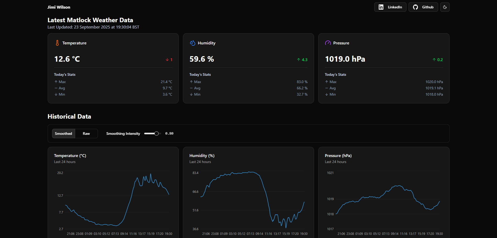

# IoT Weather Station

A solar-powered, autonomous weather station that captures environmental data and visualizes it on a live dashboard.

## Live Demo

[See The Weather Station In Action](https://weather.jimiwilson.tech/)

##  Screenshot

## Key Features

- Solar Powered & Autonomous Operation: Engineered with power-efficient C++ firmware using deep sleep modes, allowing the device to run indefinitely off-grid.

- Live Data Visualization: A responsive dashboard with interactive charts that display the latest sensor readings, uploaded periodically from the off-grid device.

- Resilient Data Pipeline: The device buffers sensor readings to a local filesystem, ensuring zero data loss during network outages before performing batch uploads to the API.

- Full-Stack Dockerized Deployment: The entire application is containerized with Docker and deployed to a production environment.

## Tech Stack

- **Frontend:** React, TypeScript, shadcn/ui.
- **Backend:** Django REST Framework, PostgreSQL.
- **Firmware & Hardware:** C++, ESP32, BME280, Solar Panel, VPS, and 3D Printed Stevenson Screen.
- **DevOps:** Docker, Nginx, Gunicorn.

## License

This project is licensed under the MIT License.