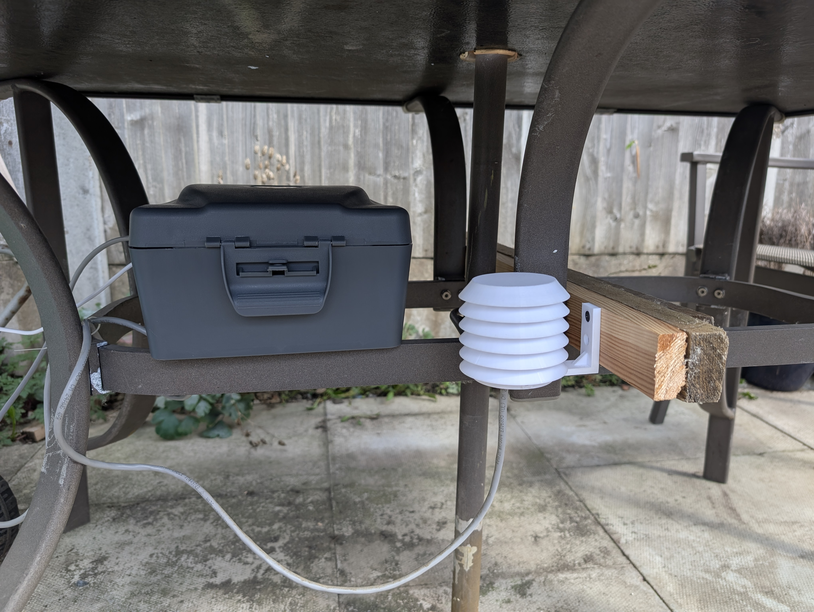
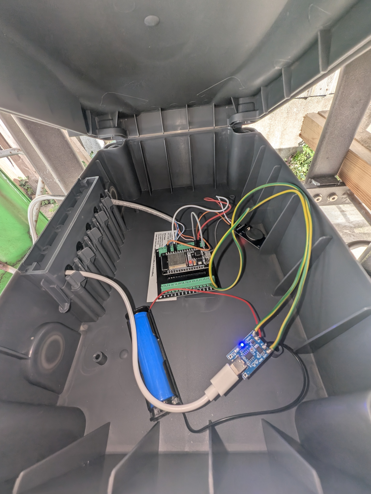

# IoT Weather Station

A solar-powered, autonomous weather station that captures environmental data and visualises it on a dashboard.

## Live Demo

[See The Weather Dashboard In Action](https://weather.jimiwilson.tech/)

##  Photos & Screenshot

## Features
- **Autonomous, Solar-powered weather station:**
The station runs entirely off-grid, powered by a solar panel and battery. The hardware is built around an ESP32 microcontroller, a BME280 sensor, housed in a 3D-printed Stevenson Screen to achieve accurate readings.
- **Power-Efficient C++ Firmware with Dynamic Uploads:** To achieve indefinite uptime, the firmware uses deep-sleep modes and interrupt-driven events. To further conserve energy, the data upload frequency is dynamically reduced at night from every 20 minutes to every hour.
- **Resilient Data Pipeline:** The firmware buffers sensor readings to the ESP32's local filesystem. This ensures zero data loss during network outages, with the device performing a batch upload to the backend API once connectivity is restored.
- **Interactive Live Dashboard:** A responsive dashboard, built with React and TypeScript, provides an interactive interface for data analysis. It visualises the latest raw sensor readings and allows the user to apply exponential smoothing to filter out noise and reveal underlying trends.

## Tech Stack

- **Frontend:** React, TypeScript, shadcn/ui.
- **Backend:** Django REST Framework, PostgreSQL.
- **Firmware & Hardware:** C++, ESP32, BME280, Solar Panel, and 3D Printed Stevenson Screen.
- **DevOps:** Docker, Nginx, Gunicorn, VPS.

## License

This project is licensed under the MIT License.